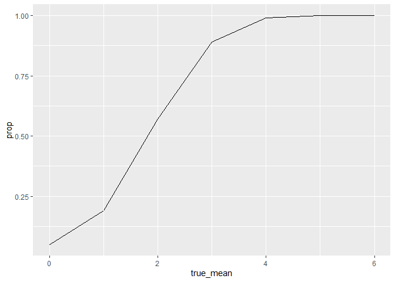
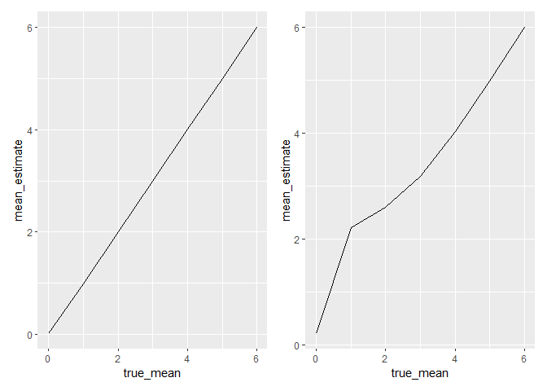
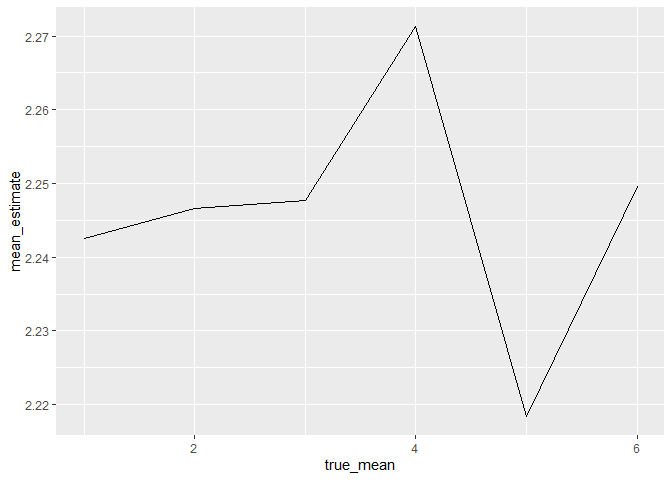

Homework 5
================
Mari Sanders

# Problem 1

``` r
bday_sim <- function(n) {
  bdays <- sample(1:365, size = n, replace = TRUE) 
  
  duplicate <- length(unique(bdays)) < n
  
  return(duplicate)
}

sim_res <- 
  expand_grid(
    n = 2:50, 
    iter = 1:10000
  ) %>% 
  mutate(res = map_lgl(n, bday_sim)) %>% 
  group_by(n) %>% 
  summarize(prob = mean(res))

sim_res %>% 
  ggplot(aes(x = n, y = prob)) + geom_line()
```

<!-- -->

# Problem 2

``` r
normal_dist <- function(n, true_mean, sd = 5) {
  sim_data <- rnorm(n = 30, mean = true_mean, sd = 5)
  t_test <- t.test(sim_data)
  results <- broom::tidy(t_test)
  
}

sim_results_df <- 
  expand_grid(
    sample_size = 30,
    true_mean = c(1,2,3,4,5,6),
    iter = 1:5000
  ) %>% 
  mutate(
    estimate_df = map(sample_size, \(x) normal_dist(x,true_mean, sd))) %>% 
      unnest(estimate_df) %>% select(estimate, p.value, true_mean) 

sim_results_df %>% 
  filter(p.value < 0.05) %>% 
  group_by(true_mean) %>% 
  summarize(count = n()) %>% 
  ggplot(aes(x = true_mean, y = count)) + geom_line()
```

<!-- -->

``` r
sim_results_df %>% 
  group_by(true_mean) %>% 
  summarize(mean_estimate = mean(estimate, na.rm = TRUE)) %>% 
  ggplot(aes(x = true_mean, y = mean_estimate)) +  geom_line()
```

<!-- -->

``` r
sim_results_df %>% 
  filter(p.value < 0.05) %>% 
  group_by(true_mean) %>% 
  summarize(mean_estimate = mean(estimate, na.rm = TRUE)) %>% 
  ggplot(aes(x = true_mean, y = mean_estimate))  + geom_line()
```

<!-- -->

# Problem 3

``` r
homicide_df <- read_csv("data/homicide-data.csv") %>% 
  unite(city_state, c(city, state), sep = ", ") %>% 
  mutate(result = ifelse(disposition == "Closed without arrest" | disposition == "Open/No arrest", "unsolved", "solved"))
```

    ## Rows: 52179 Columns: 12
    ## ── Column specification ────────────────────────────────────────────────────────
    ## Delimiter: ","
    ## chr (9): uid, victim_last, victim_first, victim_race, victim_age, victim_sex...
    ## dbl (3): reported_date, lat, lon
    ## 
    ## ℹ Use `spec()` to retrieve the full column specification for this data.
    ## ℹ Specify the column types or set `show_col_types = FALSE` to quiet this message.

Describe the data.

``` r
homicide_df %>% 
  group_by(city_state, result) %>% 
  summarize(count = n()) %>% 
  pivot_wider(
    names_from = "city_state",
    values_from = count
  ) %>% knitr::kable()
```

    ## `summarise()` has grouped output by 'city_state'. You can override using the
    ## `.groups` argument.

| result   | Albuquerque, NM | Atlanta, GA | Baltimore, MD | Baton Rouge, LA | Birmingham, AL | Boston, MA | Buffalo, NY | Charlotte, NC | Chicago, IL | Cincinnati, OH | Columbus, OH | Dallas, TX | Denver, CO | Detroit, MI | Durham, NC | Fort Worth, TX | Fresno, CA | Houston, TX | Indianapolis, IN | Jacksonville, FL | Kansas City, MO | Las Vegas, NV | Long Beach, CA | Los Angeles, CA | Louisville, KY | Memphis, TN | Miami, FL | Milwaukee, wI | Minneapolis, MN | Nashville, TN | New Orleans, LA | New York, NY | Oakland, CA | Oklahoma City, OK | Omaha, NE | Philadelphia, PA | Phoenix, AZ | Pittsburgh, PA | Richmond, VA | Sacramento, CA | San Antonio, TX | San Bernardino, CA | San Diego, CA | San Francisco, CA | Savannah, GA | St. Louis, MO | Stockton, CA | Tampa, FL | Tulsa, AL | Tulsa, OK | Washington, DC |
|:---------|----------------:|------------:|--------------:|----------------:|---------------:|-----------:|------------:|--------------:|------------:|---------------:|-------------:|-----------:|-----------:|------------:|-----------:|---------------:|-----------:|------------:|-----------------:|-----------------:|----------------:|--------------:|---------------:|----------------:|---------------:|------------:|----------:|--------------:|----------------:|--------------:|----------------:|-------------:|------------:|------------------:|----------:|-----------------:|------------:|---------------:|-------------:|---------------:|----------------:|-------------------:|--------------:|------------------:|-------------:|--------------:|-------------:|----------:|----------:|----------:|---------------:|
| solved   |             232 |         600 |          1002 |             228 |            453 |        304 |         202 |           481 |        1462 |            385 |          509 |        813 |        143 |        1037 |        175 |            294 |        318 |        1449 |              728 |              571 |             704 |           809 |            222 |            1151 |            315 |        1031 |       294 |           712 |             179 |           489 |             504 |          384 |         439 |               346 |       240 |             1677 |         410 |            294 |          316 |            237 |             476 |                105 |           286 |               327 |          131 |           772 |          178 |       113 |         1 |       390 |            756 |
| unsolved |             146 |         373 |          1825 |             196 |            347 |        310 |         319 |           206 |        4073 |            309 |          575 |        754 |        169 |        1482 |        101 |            255 |        169 |        1493 |              594 |              597 |             486 |           572 |            156 |            1106 |            261 |         483 |       450 |           403 |             187 |           278 |             930 |          243 |         508 |               326 |       169 |             1360 |         504 |            337 |          113 |            139 |             357 |                170 |           175 |               336 |          115 |           905 |          266 |        95 |        NA |       193 |            589 |

Baltimore Homicide Proportion

``` r
baltimore_homicide <- 
  homicide_df  %>% 
  filter(city_state == "Baltimore, MD") %>% 
  group_by(result) %>% 
  summarize(count = n()) 

unsolved_count <- baltimore_homicide %>% 
  filter(result == "unsolved") %>% 
  pull(count)

total_count <- baltimore_homicide  %>% 
  summarize(total = sum(count)) %>% 
  pull(total)

broom::tidy(prop.test(unsolved_count, total_count)) %>% 
  select(estimate, conf.low, conf.high)
```

    ## # A tibble: 1 × 3
    ##   estimate conf.low conf.high
    ##      <dbl>    <dbl>     <dbl>
    ## 1    0.646    0.628     0.663

Other cities Homicide Proportion

``` r
city_cases <- 
  homicide_df %>% 
  group_by(city_state, result) %>% 
  summarize(count = n())
```

    ## `summarise()` has grouped output by 'city_state'. You can override using the
    ## `.groups` argument.

``` r
city_counts <- city_cases %>%
  pivot_wider(names_from = result, values_from = count, values_fill = 0) %>%
  mutate(
    unsolved_count = unsolved,
    total_count = solved + unsolved
  )


results <- city_counts %>% 
  group_by(city_state) %>% 
  mutate(prop_test = map2(unsolved_count,total_count, \(x,y) prop.test(x = x, n = y )),
         tidy = map(prop_test, broom::tidy)) %>% 
  unnest(tidy) %>% select(city_state, estimate, conf.low, conf.high)
```

    ## Warning: There was 1 warning in `mutate()`.
    ## ℹ In argument: `prop_test = map2(...)`.
    ## ℹ In group 49: `city_state = "Tulsa, AL"`.
    ## Caused by warning in `prop.test()`:
    ## ! Chi-squared approximation may be incorrect

``` r
results %>% 
  ggplot(aes(x = fct_reorder(city_state, estimate), y = estimate)) + 
  geom_point() +
  geom_errorbar(aes(ymin = conf.low, ymax = conf.high)) +
  theme(axis.text.x = element_text(angle = 90, vjust = 0.5, hjust = 1)) + labs(
    title = "Proportion of Unsolved Homicides by City",
    x = "City",
    y = "Estimated Proportion of Unsolved Homicides"
  )
```

<!-- -->
