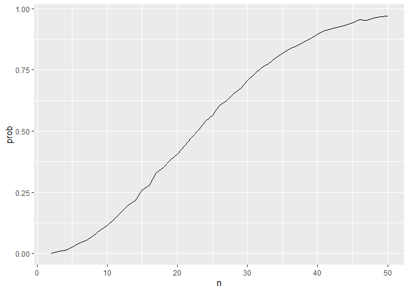

Homework 5
================
Mari Sanders

# Problem 1

``` r
bday_sim <- function(n) {
  bdays <- sample(1:365, size = n, replace = TRUE) 
  
  duplicate <- length(unique(bdays)) < n
  
  return(duplicate)
}

sim_res <- 
  expand_grid(
    n = 2:50, 
    iter = 1:10000
  ) %>% 
  mutate(res = map_lgl(n, bday_sim)) %>% 
  group_by(n) %>% 
  summarize(prob = mean(res))

sim_res %>% 
  ggplot(aes(x = n, y = prob)) + geom_line()
```

<!-- -->

# Problem 2
